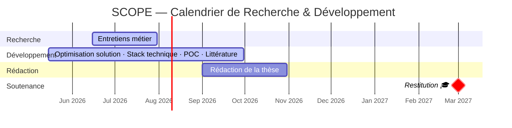

<div align="center">

[🇫🇷 Français](README.md) &nbsp;·&nbsp; [🇬🇧 English](README.en.md) &nbsp;·&nbsp; [🇵🇱 Polski](README.pl.md)

<br>


# Bartosz Jankowski

**Senior Product Manager construisant ses compétences IA & data pour transformer 13 ans d'expertise industrielle en systèmes qui amplifient le jugement humain.**

<br>

[](https://www.linkedin.com/in/bartosz-jankowski-7a139346)
[](mailto:bjankowski@outlook.fr)
[](https://www.google.com/maps/place/Lyon)
[](https://executive-education.devinci.fr)

</div>

---

## Qui suis-je ?

13 ans à faire le pont entre des contraintes terrain complexes et des équipes qui n'ont pas toujours le même langage. Automobile, confort thermique, smart city — toujours à l'intersection entre le technique et le business.

Aujourd'hui, je construis une couche IA & data sur cette base. Pas pour devenir data scientist — mais pour être le PM qui comprend les architectures, challenge les hypothèses, et sait distinguer là où l'IA crée une vraie valeur opérationnelle de là où elle crée du risque.

Je prépare un **MBA IA & Data Innovation (RNCP Niveau 7)** à De Vinci Executive Education. Ma thèse-projet est déployée sur terrain industriel réel, en partenariat avec un équipementier automobile mondial majeur. Je la construis comme un vrai projet d'accompagnement — de la définition du besoin à l'implémentation, jusqu'à la conduite du changement.

---

## Projet de Thèse — SCOPE

> **Smart Catalogue & Optimised Pricing Engine**
> *Système IA de cross-référencement de catalogue et de recommandation pricing multi-scénarios pour l'aftermarket automobile*

### Le problème

Les acteurs de l'aftermarket automobile gèrent des catalogues de **50 000+ références produits**. Deux goulots d'étranglement structurels :

**Cohérence catalogue** : les données internes (marketing ↔ ERP) divergent ; le cross-référencement concurrentiel est manuel, chronophage et non systématique à grande échelle.

**Pricing à grande échelle** : équilibrer positionnement marché, objectifs de marge et élasticité-prix sur des dizaines de milliers de références reste aujourd'hui un travail en grande partie manuel.

### Approche — Un projet construit de bout en bout

#### 1. Définition du besoin — Recherche-action terrain

Avant toute architecture : **13 entretiens structurés** avec les profils clés — pricing stratégique et opérationnel, trade marketing, finance, data & BI, experts IA. Pas une étude de cas — une co-construction du besoin réel avec les futurs utilisateurs, pour concevoir une solution qui tient sur le terrain.

#### 2. Solution — Architecture 4 briques séquentielles

```
┌──────────────────────────────────────────────────────────┐
│           B1 — Gouvernance des Données  (Socle)          │
│   Qualité · Ownership · RGPD · EU AI Act · Art.101 TFUE  │
└─────────────────────────┬────────────────────────────────┘
                          │  prérequis
           ┌──────────────┴──────────────┐
           ▼                             ▼
┌──────────────────┐        ┌───────────────────────────┐
│  B2 — Cross-     │        │   B3 — Moteur Pricing  ⭐  │
│  référencement ⭐│──────▶│   Multi-Scénarios          │
│  Contribution #1 │        │   Contribution #2 — Cœur  │
└──────────────────┘        └───────────────────────────┘
          │                              │
          └──────────────┬───────────────┘
                         ▼
          ┌──────────────────────────────┐
          │   B4 — Interface Intégrée    │
          │   Dashboard · Validation     │
          └──────────────────────────────┘
```

**B1 — Gouvernance** : normalisation des données, conformité RGPD, alignement EU AI Act, légalité des données concurrentielles (Art. 101 TFUE). Prérequis non-IA — condition sine qua non pour que B2 et B3 produisent des résultats fiables et juridiquement défendables.

**B2 — Cross-référencement IA** ⭐ : matching structuré sur base de compatibilité véhicule-pièce, complété par NLP et embeddings sémantiques sur données non normalisées.

**B3 — Moteur pricing multi-scénarios** ⭐ : trois recommandations simultanées — règles métier via RAG, plancher de marge brute, modèle d'élasticité-prix construit sur données historiques. Objectif : raccourcir le temps d'analyse et optimiser la prise de décision.

**B4 — Interface intégrée** : dashboard end-to-end avec validation humaine obligatoire. Interface conçue pour les non-data.

#### 3. Conduite du changement — intégrée à la conception

La conduite du changement n'est pas un livrable post-projet. Elle est embarquée dans les choix architecturaux dès le départ.

**Human-in-the-loop par design** : aucune décision n'est prise sans validation humaine. SCOPE est un outil de recommandation, pas d'automatisation.

**Déploiement séquentiel en 5 phases** : démonstration de valeur rapide dès la Phase 1 avant d'introduire les modules à plus haute complexité.

**Plan de transfert enterprise** : déploiement sur 18–24 mois, 6 phases progressives, monitoring ROI embarqué, formation et accompagnement des équipes métier.

---

## Statut du Projet



---

## Compétences & Positionnement

<div align="center">

**Métier**


<br>

**IA & Data**


</div>

---

## Contact

Disponible pour des opportunités AI/Data Product Manager — stage ou CDI.

[](https://www.linkedin.com/in/bartosz-jankowski-7a139346)
[](mailto:bjankowski@outlook.fr)
